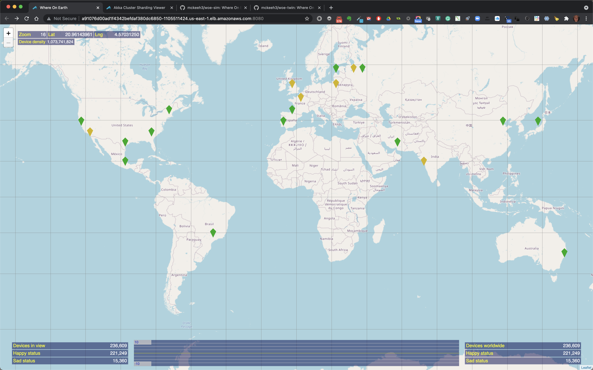
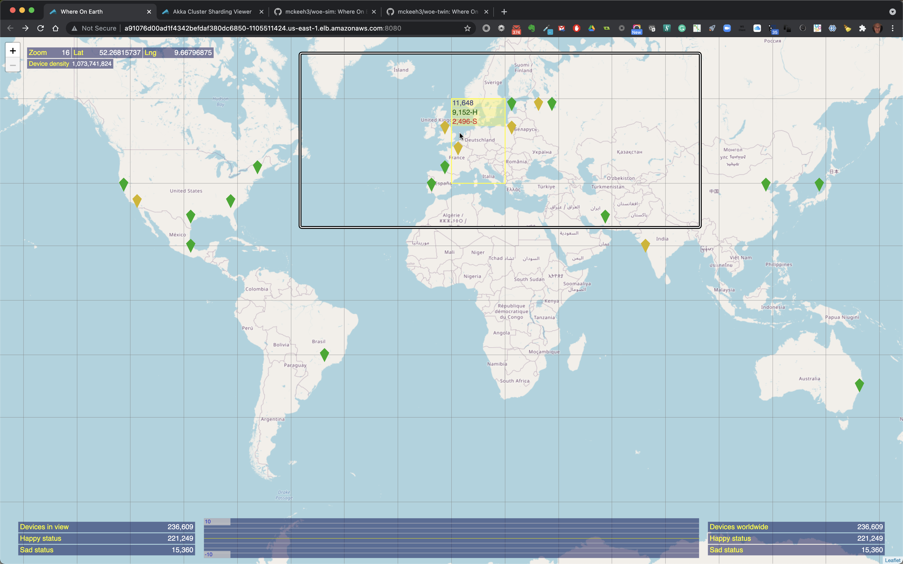
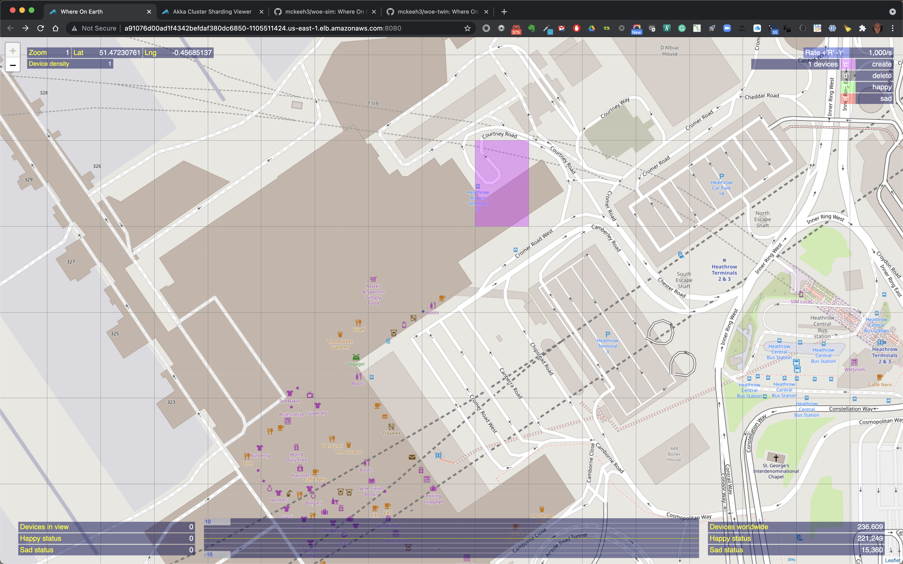

# Where On Earth Twin (woe-twin) Microservice

This microservice simulates geographically distributed IoT devices. The microservice handles incoming IoT device telemetry messages. These messages create, delete, and change the state of individual IoT devices. A map UI is used to visualize devices' location and submit commands to manipulate IoT devices.

- [Where On Earth Twin (woe-twin) Microservice](#where-on-earth-twin-woe-twin-microservice)
  - [Installation](#installation)
    - [Kubernetes Environments](#kubernetes-environments)
    - [Database Environments](#database-environments)
  - [Design notes](#design-notes)
  - [Map Regions](#map-regions)
    - [Map Region Selections](#map-region-selections)
  - [WoE Map UI](#woe-map-ui)

## Installation

How you install this Akka microservice depends on your target environment. There are environment specific README documents for each of the tested Kubernetes environments. With each deployment you also have to select which database you want to use. There are also README documents for the tested databases.

### Kubernetes Environments

- [Minikube](https://github.com/mckeeh3/woe-twin/blob/master/README-minikube.md)
- [Amazon EKS](https://github.com/mckeeh3/woe-twin/blob/master/README-amazon-eks.md)
- [Google GKE](https://github.com/mckeeh3/woe-twin/blob/master/README-google-gks.md)

### Database Environments

- [Cassandra local](https://github.com/mckeeh3/woe-twin/blob/master/README-database-cassandra-local.md)
- [Cassandra Amazon](https://github.com/mckeeh3/woe-twin/blob/master/README-database-cassandra-amazon.md)
- [Yugabyte local](https://github.com/mckeeh3/woe-twin/blob/master/README-database-cassandra-amazon.md)
- [Yugabyte Kubernetes](https://github.com/mckeeh3/woe-twin/blob/master/README-database-cassandra-amazon.md)
- [PostGreSQL local](https://github.com/mckeeh3/woe-twin/blob/master/README-database-postgresql-local.md)
- [PostgreSQL Amazon](https://github.com/mckeeh3/woe-twin/blob/master/README-database-postgresql-amazon.md)

## Design notes

TODO

## Map Regions

Map regions are a rectangular area on a global map. Regions are bounded
by a top left corner, and a bottom right corner. Corners are defined by latitude
and longitude values.

Map regions are viewed as rectangular tiles when viewed on global maps.
Each map region may be selected to contain IoT devices.

Maps are viewed at various zoom levels, from zoom level 0 to 18. Level 0
represents the entire global map, which is 180 degrees from top to bottom
and 360 degrees from left to right. Top to bottom degrees are the latitudes
and left to right degrees are longitudes.

### Map Region Selections

Map selections are rectangular areas that are bounded by a top left
corner, and a bottom left corner. Each new map selection is submitted to
a map at the top zoom level.

Each new map selection traverses each map zoom
level to determine what map regions it overlaps. As a map selection
moves through each zoom level the map regions check it to determine if
the selection overlaps the region. When a given map selection does not
overlap a map region the zoom traversal stops. When there is an overlap
the map region determines if the map selection fully or partially overlaps
the map region.

Each fully or partially overlapping  map selection is recorded by the map
region. Recorded map selections are trimmed to fall completely within the
map region.

Once overlapping map selections have been recorded the map will then pass
the map selection on to map sub regions. Typically, each map region
contains 4 sub regions. This recursion starts at zoom level 0 and continues
to zoom level 18.

## WoE Map UI

The WoE Map UI is based on Open Street Map. This is a zoom-able map similar to other web
maps, such as Google Maps.

The map shows the locations of IoT devices that have been created at various locations on the map.

At the top left the current zoom level is shown along with the longitude and latitude position of
the mouse pointer. Also shown is the device density, which is the maximum number of devices that
will fit into a geographical region on the map at the current zoom level.

The device density starts a 1 when the UI is zoomed closest to the surface of the Earth. As you
zoom out the device density increases by a factor of four - 1, 4, 16, 64, 256, 1024, 4096, etc.

When the mouse pointer is moved over a location on the map that contains IoT devices, the map region
is outlined. The outlined region also shows the total number of IoT devices in that region along
with the total number of happy and sad state IoT devices in that region when the region contains
a mix of devices in both states.

You can zoom in out by clicking the '+' plus and '-' minus signs at the top left of the map UI,
by pressing the '+' or '-' keys, using a mouse scroll wheel, or using trackpad zoom gestures.

The location of IoT devices are shown using map markers when zoomed out. Teh color of the map
markers indicates the state of the devices at the marked location. Green markers indicate that
all of the devices at the marked location are in a happy state. Red markers indicate that all
of the devices are in a sad state. Yellow indicates that there is a mix of happy and sad devices
at the marker location.

As you zoom in closer to a location that contains IoT devices the map markers are replaces with
highlighted colorized map regions.

When the mouse pointer is moved over a colorized region of the map that contains IoT devices
the region is outlined and it includes the total count of the number of devices in that region
and the number of happy and sad devices if the highlighted region contains a mix of happy and
sad devices.

At zoom level 2, regions that contain IoT devices show cross hairs that indicate the exact
location of an IoT device.

At zoom level 1, the closest to the map surface, the device cross hair is a bit larger.

Device actions are performed using the single character commands shown at the top right of
the UI - 'c' to create IoT devices, 'd' to delete, 'h' to set device states to happy, and
's' to set device states to sad.

To perform one of these commands, press one of the keys, the map region at the mouse
pointer location will be highlighted. Move the mouse to the location that you wish to perform
the action and click. This sends the command to the backend WoE microservices.

There may be a delay before the UI starts to render the changes triggered by the command.

The zoom level determines the number of IoT devices that will be created, deleted, or state
changed by a given command. The device density shown at the top left of the UI provides the
number of devices that a command will modify.

Also shown in the menu at the top right is the rate. The rate is used to throttle the flow
of device operations that will be sent to the WoE Twin microservice from the WoE Simulator
microservice. The flow rate is adjusted using the 'R' key to increase the rate, and the 'r'
key to decrease the rate.

Above is an example of creating some devices. the zoom level is 3. When the selected region
is clicked 16 IoT devices will be created in the selected region.

Above is shown the green region where the 16 devices were created.

Here above 1024 IoT devices have been created by zooming to level 6, type 'c', hover over a
region and click.

The above shows an example where 4096 devices will be created at zoom level 7. Note that the
highlighted region show '1s' at the top of the highlighted region. This indicated the time
that this request will take to be submitted at the current rate. In this example, the current
rate in 1000/s, therefore it will take about 4 seconds to feed all of the IoT device
creation requests to the WoE Twin microservice.

Shown above are the newly created 4096 devices. Note that at the bottom center of the screen
the green vertical bars. These bars shown device state change activity. The simple rate
visualization scales as the number of state change counts go up and down. The current scale
range is shown on the left.

To delete devices, zoom and position the mouse pointer to a region on the map that contains
some IoT devices, type the 'd' key, then click.

The selected devices are deleted as shown in the above example.

Here is an example of selection a larger partially filled region of devices to be deleted.

All of the devices in the selected region are deleted and cleared from the map.

You can change the state of existing devices. New IoT devices are initially created in a happy/green state.
Happy state devices can be changed to a sad state using the 's' key, position the highlighted region on
the map, and click.

Likewise, to change devices from a sad to happy state, use the 'h' key, position the highlighted region
over some currently sad devices, and click.

All of the sad devices in the selected location are changed to a happy state.
